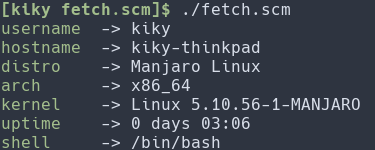

<h1 align="center">fetch.scm</h1>

[](https://aur.archlinux.org/packages/fetch-scm/)

<p align="center"></p>
<h4 align="center">System information fetcher written in GNU Guile Scheme</h4>

## Dependencies
- GNU/Linux distro
- `guile`

## Using
```sh
./fetch.scm
```
